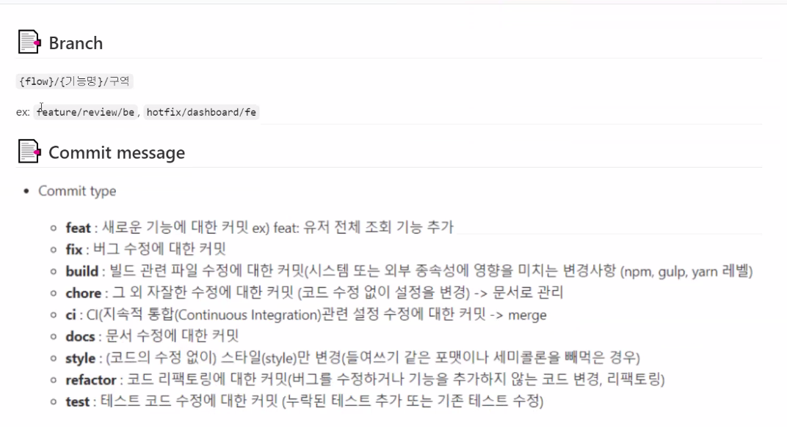

## 논의한 내용

### GitLab Repo 디렉토리 구조

- main
  - README.md: 폴더 구조 설명, 프로젝트 설명, 
  - personal
    - 이름
      - README.md: 개인별 Sub-PJT II 진행상황 등 자유
      - 이하 팀원별 자유
  - 기획
    - 요구사항 명세서.pdf
    - 
  - 설계
    - 와이어프레임.pdf
    - 
  - frontend
    - README.md
  - backend
    - README.md
  - embedded
    - README.md
  - 테스트
  - 배포

### 브랜치

[참고](https://techblog.woowahan.com/2553/)

- master
- hotfixes
- develop
- release
- frontend-기능명
- backend-기능명
- embedded-기능명
- TIL

추가 브랜치 필요한 경우 문의!

### 커밋 메세지 컨벤션

- docs/TIL/날짜: TIL README.md 할 때
- 