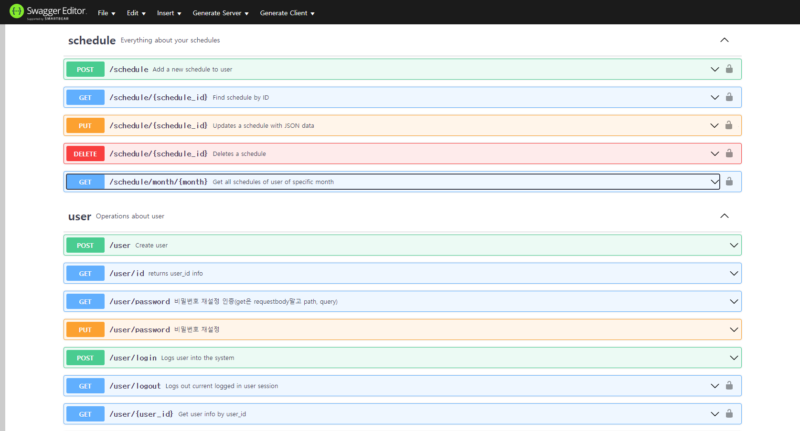

# GET IT START

### AWS 서버에 SSH 연결
ssh 로 i5a109.p.ssafy.io:22 에 접속합니다.
아래의 툴들을 사용할 수 있으며, 볼드처리된 툴을 권장드립니다.
>- **mobaXterm**
>- **(VScode) Remote Plugin**
>- putty

서버 접속 권한을 인가받는 방식은 두가지 방식이 있습니다.
1. ssafy 운영진으로부터 받은 pem파일로 인증을 받습니다.
2. 리눅스에 생성된 계정으로 접속한다
   1. 팀원들의 이니셜로 계정이 생성되어 있습니다.(kjh, jbj, ytl, har, sej)
   2. 따로 전달드린 비밀번호를 이용해 처음 로그인 하면 쉘에서 안내하는 대로 비밀번호를 변경해주시면 됩니다.
   3. 비밀번호 변경이 작동하지 않을 경우, passwd 명령어로 변경하실 수 있습니다.


### nodejs, mariaDB 설정

```bash
#@/backend/src/.env에서 파일을 설정해줍니다.

$ cd @/backend/src

$ vi .env
---
NODEJS_PORT=서버 개방할 포트

//MySQL
MYSQL_USERNAME=mariaDB 접속 계정 명
MYSQL_PASSWORD=mariaDB 비밀번호
MYSQL_DATABASE="sfens"
MYSQL_HOST=mariaDB 접속 호스트 주소 || 127.0.0.1
MYSQL_PORT=mariaDB 접속 포트 || 3308
```

### nodejs 서버 실행

```bash
#nodejs index파일을 run합니다. 파일이 수정되면 감지해서 재실행합니다.
$ npx nodemon index.js
```
# Directory

> <div style="text-align:right">2021.08.05</div>
>
>**/backend/src**
>├── **/config**
>│   ├── **config.js** => Sequelize 설정파일
>│   └── **cors.js** => cors 이슈 핸들링 모듈
>│   
>├── **/migrate**
>│   └── **...create....js** => Sequeilze DB 스키마 생성/삭제
>│   
>├── **/models**
>│   ├── **index.js** => Sequeilze 스키마 구성
>│   └── **...js** => 생성된 모델 파일
>│   
>├── **/routes** => restAPI url 라우팅
>│   ├── **/schedule** 
>│   ├── **/average** 
>│   ├── **/user** 
>│   ├── ~~/aa => 라우팅 기능 테스트~~
>│   └── ~~/mvp => 1주차 임시 기능 구현~~
>│
>├── **/seeder** => Sequelize 임시 데이터 삽입
>│   └── 20210727005315-addSchedule.js => schedule 데이터 정보 파일
>│   
>├── **/service** => restAPI 비즈니스 로직 구현
>│   ├── **/scheduleService**
>│   ├── **/averageService**
>│   ├── **/userService**
>│   └── ~~/mvp => 1주차 임시 기능 구현~~
>│
>├── **/validation** => restAPI params, body 유효성 검증 로직
>│  
>├── **.env** => mariaDB, nodejs 설정값
>└── **.index.js** => nodejs 서버 구동
>

# URL

restAPI에 따르는 URL 경로와 payload 명세는 [Swagger openAPI](./../docs/openapi.yaml)를 참고해 주세요
# ERROR
<div style="text-align:right">Ubuntu 20.04 LTS</div>
Get it start 를 따라했을 때 아래의 에러가 나는 경우

> already use in 0.0.0.0:8079

포트를 사용하고 있어 서버를 구동할 수 없을 때 발생하는 에러입니다.
AWS는 여러명이 사용하는 메인 프레임식 구조이므로, 다른 사람이 이미 서버를 실행했을 수 있습니다. 

#### Solution1

다른 build & run 모듈인 pm2가 해당 포트를 사용하는 중 일 수 있습니다.

```bash
# pm2로 실행중인 프로세스들을 확인합니다.
$ pm2 list
...process list

# pm2에서 실행되고있는 프로세스를 중지시켜 포트를 확보합니다.
$ pm2 stop [process index]
```


###Solution 2

포트를 사용하고있는 프로세스를 종료합니다.

```bash
# 현재 실행중인 프로세스들과 사용중인 포트를 나타냅니다.
$ sudo netstat -nap | grep 8079
...port ... process Inode

# 해당 프로세스를 종료합니다.
$ sudo kill -9 process Inode
```