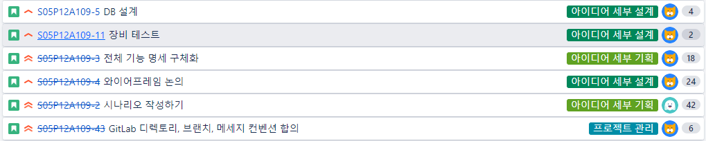

- 월요일(각 `8`시간)
  - 기획
    - 시나리오 작성하기
      - 각자 시나리오 파트 작성 (각 `4`시간)
    - 전체 기능 명세 구체화
      - 선행: 여태가지 문서 정리
      - 기능 아이디어 공유 (각 `2`시간)
      - 입출력 장치 논의 (각 `1`시간)
  - 프로젝트 관리
    - GitLab 디렉토리, 브랜치, 메세지 컨벤션 합의 (각 `1`시간)
- 화요일(각 `8`시간)
  - 기획(각 `3`시간)
    - 시나리오 작성하기
      - 시나리오 공유 & 피드백 (각 `3`시간)
  - 설계(각 `5`시간)
    - 와이어프레임 논의
      - 와이어프레임 툴 실습 (각 `3`시간)
      - 와이어프레임 추가 논의 (장범진, 허애리, 김송현 `2`시간)
    - DB 설계 (이하 김지환, 이태용)
      - ERD 작성 논의 (김, 이 `2`시간)
    - 장비 테스트 (이하 신은지)
      - 디스플레이 테스트 (신 `2`시간)

총 96시간(`2일*8시간*6명*`)
