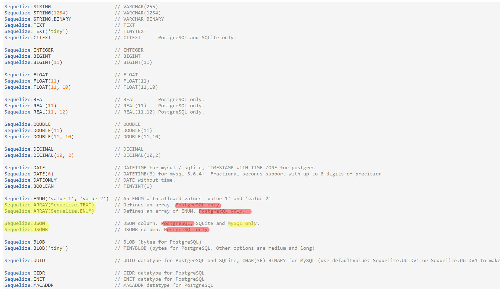
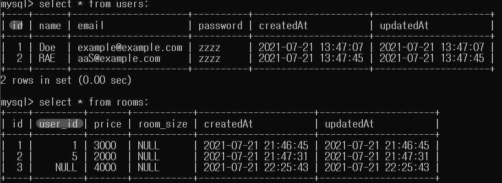
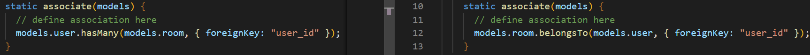

# Sequelize로 Back reference를 할 수 있을까?

>  A : 안될 것 같다.

### 이유 1

https://sequelize.org/v5/manual/data-types.html

Sequelizer에서 제공하는 자료형 중에 역전파에 사용할 수 있는 자료형이 없습니다.

JSON이나 ENUM으로 array와 유사하게 구현할 수는 있어 보이지만 자료형이 제공하는 의도에 맞지 않게 사용하는 것이라 생각됩니다.

### 이유 2

https://sequelize.org/master/manual/assocs.html

 실제로 사용해봤을 때도, update나 delete같은 동작이 수행되었을 때 트리거로 동작할 수 있도록 규정하는 역할을 하지, 스키마 구조 자체를 변경하지는 못하는 것 같습니다.

- 부모(users)와 자식(rooms)를 갖는 DB

- 관계 (1:N관계)
- 하나의 user는 여러 rooms를 가진다.

# 결론

hasMany, beloneTo 등등의 메서드를 지원하지만 

 이는 저희가 생각했던 것처럼 부모 인스턴스에서 자식 인스턴스의 Primary key를 여러개 가지고 있을 수 있음을 의미하는 것이 아니라, 스키마에 정의해둠으로 하나의 테이블의 수정이 이루어지면 다른 테이블도 연간되어 수정되는 등의 행위를 의미하는 것 같습니다.

 예를들면, hasMany에 onDelete : CASCADE 옵션을 주면, User 테이블 인스턴스가 delete 되면 1:M 관계로 맺어진 post의 테이블 인스턴스들도 함께 삭제되도록 할 수 있습습니다.

 이런 기능을 봤을 때, 저희가 의도한 기능은 아닌 것 같습니다.