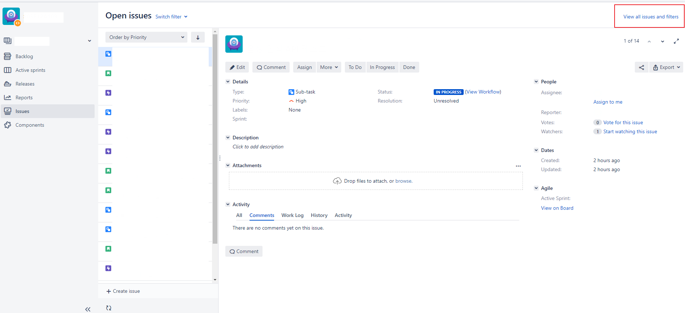
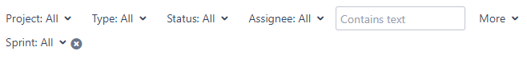
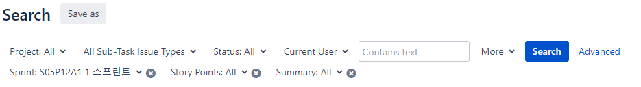
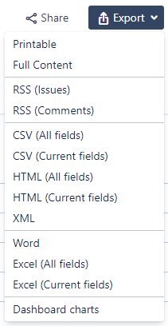
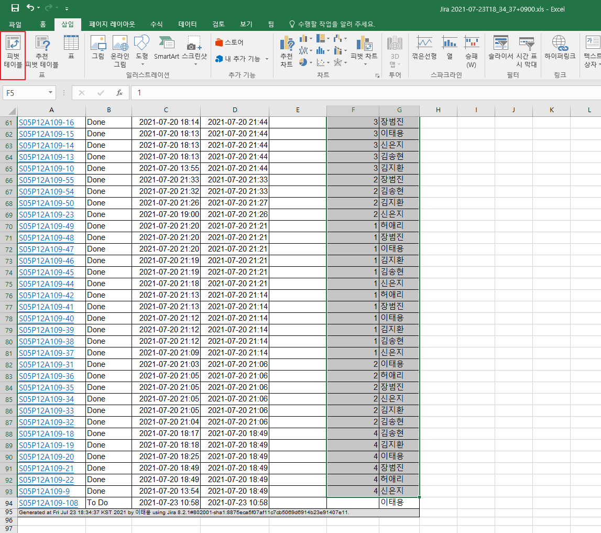
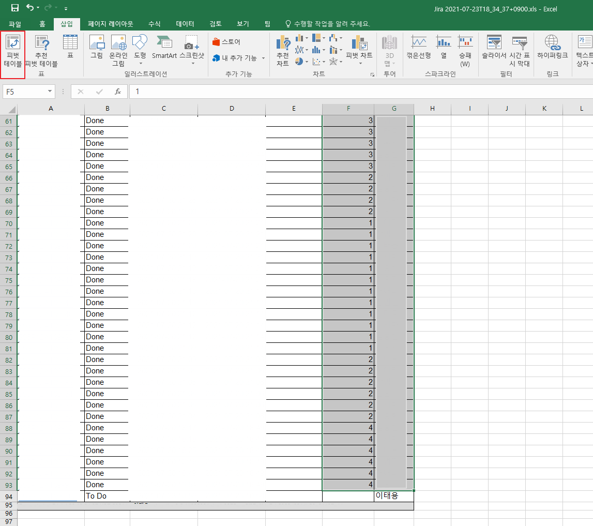
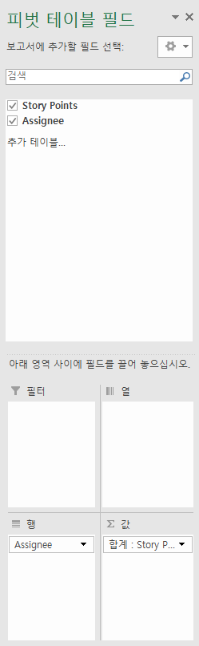
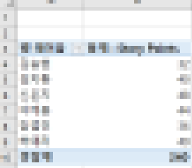

# JIRA story point 계산하기

Language는 영어로 설정한 상태입니다.

팀장이 아닌 팀원 계정 기준입니다.

버젼에 따라 화면 구성이 다를 수 있습니다

프로젝트에서 [Issues] 페이지로 갑니다.

우측 상단의 [View all issues and filters]를 클릭합니다.

진입한 Search 창에서 상단의 필터 Basic 선택 부분을 보겠습니다.

[More]를 눌러 [Sprint]를 추가해주고, Story Point의 합을 구하고자 하는 스프린트를 선택합니다. 만약 프로젝트 단위로 조회하는 경우에는 Sprint 대신 [Project: All]에서 해당하는 프로젝트를 선택합니다.

우리는 Sub-Task 기준으로 Story Point를 합산하므로 [Type: All]을 눌러 [All Sub-Task Issue Types] 혹은 [Sub-Task]를 선택합니다. 만약 다른 기준으로 합산한다면 그에 맞는 이슈 단위를 선택합니다.

본인의 Story Point만 조회하고 싶다면 [Assignee: All]을 눌러 [Currest User] 혹은 본인의 계정을 선택합니다. Dashboard를 위한 Filter를 만드는 경우라면 [Current User]를 선택합니다. 모든 사람의 Story Point를 친절히 조회해주는 것이라면 [Assignee: All] 그대로 둡니다.

[해당 스프린트에 사용자 본인의 서브-태스크를 모두 조회하는 예시]

Search를 눌러 반영합니다.

보기 좋게 우측의 햄버거 버튼을 클릭하여 [List View]로 변경합니다.

그 바로 아래의 [Columns]를 클릭하여 각 Sub-Task를 수행한 사람[Assignee]와 [Story Points]를 선택합니다.

이제 출력된 결과를 내보내기 하겠습니다.

저는 Excel (Current fields) 로 내보내기 하겠습니다. [Columns]에서 선택한 내용만 출력되어 깔끔하게 나옵니다.

다운로드된 파일을 열고 Story Points, Assignee 데이터를 선택합니다. Story Point가 없는 행은 선택되지 않도록 주의해주세요.

그리고 [삽입] 탭의 [피벗 테이블]을 클릭합니다. 

[피벗 테이블 만들기] 창이 뜨면 [확인]을 누릅니다.

새롭게 추가된 시트에서 [피벗 테이블 필드] 창의 [Story Points]와 [Assignee]를 선택합니다. 자동적으로 다음과 같이 분류되지만, 그렇지 않은 경우 직접 옮겨주시면 됩니다.

아래와 같이 잘 뽑히는 것을 볼 수 있습니다.

참고자료

https://community.atlassian.com/t5/Jira-questions/JQL-Query-for-Summing-Completed-Story-Points-Per-Assignee/qaq-p/693847

https://agiledocssoftware.com/how-to-easily-sum-story-points-in-jira/

https://www.atlassian.com/software/jira/automation-template-library/sum-up-story-points