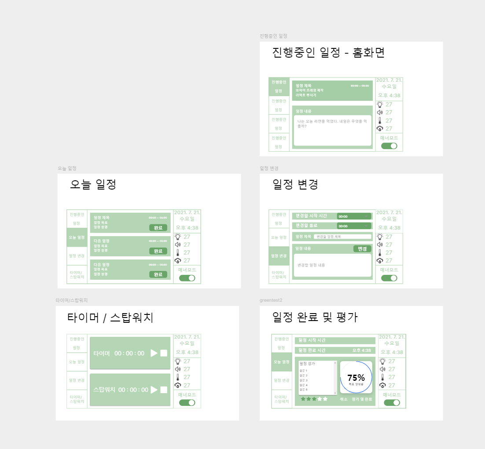

## 와이어 프레임 제작
### Framer.com 이용


### 컴포넌트 구조 설계
#### views
    Home           -- main page
    Progress page  -- 진행중인 일정
    Today page     -- 오늘 일정
    Change page    -- 일정 변경
    Rating page    -- 일정 평가
    Timer / Stopwatch page   - 타이머 / 스톱워치

### 구조
```
├─Frontend
│  ├─src
│  │  ├─assets
│  │  ├─common
│  │  ├─components
│  │  ├─context
│  │  ├─layout
│  │  ├─pages
│  │
│  ├─publiic 
│  ├─docs
│  
└─Backend
   ├─docs
   │      01-프로그램-설치.md
   │      02-플러그인-설치.md
   └─src
```
